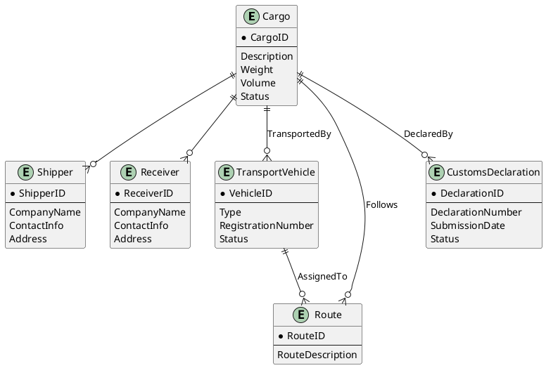

### Лабораторная работа: Проектирование модели данных

**Описание работы:**  
В данной лабораторной работе студенты будут заниматься проектированием моделей данных для различных предметных областей. Каждая предметная область предполагает решение типичных задач управления информацией, таких как учет клиентов, товаров, заказов и взаимодействий между ними. Студенты должны определить сущности, взаимосвязи между ними и создать модель данных, которая может быть использована в базе данных для хранения и обработки информации. Основная цель работы — научиться проектировать корректные структуры данных с учетом требований предметной области.

**Цель лабораторной работы:**  
- Научиться анализировать предметную область и выделять ключевые сущности.
- Научиться проектировать взаимосвязи между сущностями.
- Научиться создавать ER-диаграммы для визуализации структуры данных.

**Что нужно сделать:**
1. Для каждой предложенной предметной области, выберите ключевые сущности, которые будут представлены в модели данных.
2. Определите, какие связи существуют между сущностями (1:1, 1:N, M:N).
3. Постройте ER-диаграмму, которая наглядно покажет структуру данных и взаимосвязи между сущностями. Для этого используйте нотацию PlantUML. В диаграмме должны быть указаны все основные атрибуты сущностей и связи между ними.

**Результат работы:**  
После выполнения задания у вас должна быть готовая модель данных, описанная с помощью ER-диаграммы, которая может быть использована для реализации базы данных.

**Дедлайны выполнения лабораторной работы уточняйте у своего семинариста**

### Основные термины

1. **Модель данных**  
   Модель данных — это абстрактное представление структуры данных и их взаимосвязей в информационной системе. Она определяет, как данные будут храниться, организовываться и манипулироваться в базе данных.

2. **Сущность (Entity)**  
   Сущность — это объект или концепция, которая имеет значение в контексте предметной области и которую нужно хранить в базе данных. Например, в системе учета студентов сущностями могут быть «Студент», «Курс», «Преподаватель».

3. **Атрибут (Attribute)**  
   Атрибут — это характеристика или свойство сущности. Например, для сущности «Студент» атрибутами могут быть «Имя», «Фамилия», «Дата рождения».

4. **Связь (Relationship)**  
   Связь — это ассоциация между двумя или несколькими сущностями. Она описывает, как сущности взаимодействуют друг с другом. Например, связь может быть «Записан на» между сущностями «Студент» и «Курс».

5. **Тип связи (Relationship Type)**  
   Тип связи определяет, сколько экземпляров одной сущности может быть связано с экземплярами другой сущности. Основные типы связей:
   - **1:1 (Один к одному)** — каждый экземпляр одной сущности связан с одним экземпляром другой сущности.
   - **1:N (Один ко многим)** — один экземпляр одной сущности связан с несколькими экземплярами другой сущности.
   - **M:N (Многие ко многим)** — несколько экземпляров одной сущности связаны с несколькими экземплярами другой сущности.
   
6. **ER-диаграмма (Entity-Relationship Diagram)**  
   ER-диаграмма — это графическое представление модели данных. Она показывает сущности, их атрибуты и связи между ними, а также типы связей и ограничения. ER-диаграммы используются для проектирования и анализа баз данных.

7. **PlantUML**  
   PlantUML — это инструмент для создания диаграмм и графиков, в том числе ER-диаграмм, с помощью текстового описания. Он позволяет визуализировать модели данных в удобном и понятном виде. Вы можете использовать [PlantUML Editor](https://plantuml-editor.kkeisuke.com/) для создания и редактирования диаграмм.

---

### Вариант 1: Управление библиотекой

**Задача 1: Определение модели данных для управления библиотекой**  
Смоделируйте систему для управления библиотечным фондом. Необходимо учитывать книги, авторов и читателей. Система должна поддерживать хранение данных о том, какие книги есть в библиотеке, кто их написал и кто их берет на прочтение.

**Задача 2: Определение связей между сущностями**  
Определите связи между книгами, авторами и читателями. Каждая книга может быть написана одним или несколькими авторами. Каждый читатель может брать несколько книг. Определите типы связей между этими сущностями.

**Задача 3: Построение ER-диаграммы**  
Постройте ER-диаграмму для описанной модели данных с использованием PlantUML. Необходимо описать сущности для книг, авторов и читателей и указать связи между ними.

---

### Вариант 2: Интернет-магазин

**Задача 1: Определение модели данных для интернет-магазина**  
Создайте модель данных для интернет-магазина, который управляет товарами, покупателями и заказами. В системе должна храниться информация о том, какие товары предлагаются к продаже, кто покупатели и какие заказы они делают.

**Задача 2: Определение связей между сущностями**  
Определите связи между сущностями товара, покупателя и заказа. Один заказ может включать несколько товаров. Один покупатель может сделать несколько заказов. Определите типы этих связей.

**Задача 3: Построение ER-диаграммы**  
Постройте ER-диаграмму для описанной модели данных с использованием PlantUML. Необходимо описать сущности для товаров, покупателей и заказов и указать связи между ними.

---

### Вариант 3: Автопрокат

**Задача 1: Определение модели данных для автопроката**  
Создайте модель данных для системы управления автопрокатом. В системе должны учитываться автомобили, клиенты и аренды. Необходимо учитывать, какие автомобили доступны, кто их арендует и на какой срок.

**Задача 2: Определение связей между сущностями**  
Определите связи между автомобилями, клиентами и арендными договорами. Один клиент может арендовать несколько автомобилей, а один автомобиль может быть арендован несколькими клиентами в разное время. Определите типы этих связей.

**Задача 3: Построение ER-диаграммы**  
Постройте ER-диаграмму для описанной модели данных с использованием PlantUML. Опишите сущности для автомобилей, клиентов и аренд и укажите связи между ними.

---

### Вариант 4: Управление университетом

**Задача 1: Определение модели данных для расписания занятий в университете**  
Создайте модель данных для управления расписанием занятий в университете. В системе должны учитываться курсы, преподаватели и студенты.

**Задача 2: Определение связей между сущностями**  
Определите связи между курсами, преподавателями и студентами. Один курс может быть преподаваем несколькими преподавателями. Один студент может быть записан на несколько курсов. Определите типы связей между этими сущностями.

**Задача 3: Построение ER-диаграммы**  
Постройте ER-диаграмму для описанной модели данных с использованием PlantUML. Необходимо описать сущности для курсов, преподавателей и студентов и указать связи между ними.

---

### Вариант 5: Ресторан

**Задача 1: Определение модели данных для управления заказами в ресторане**  
Создайте модель данных для системы управления заказами в ресторане. В системе должны учитываться блюда, официанты и клиенты.

**Задача 2: Определение связей между сущностями**  
Определите связи между блюдами, заказами и клиентами. Один заказ может включать несколько блюд, а один клиент может сделать несколько заказов. Определите типы связей между этими сущностями.

**Задача 3: Построение ER-диаграммы**  
Постройте ER-диаграмму для описанной модели данных с использованием PlantUML. Описать сущности для блюд, заказов и клиентов и указать связи между ними.

---

### Вариант 6: Больница

**Задача 1: Определение модели данных для управления пациентами и медицинскими записями**  
Создайте модель данных для управления медицинскими записями пациентов в больнице. В системе должны учитываться пациенты, врачи и медицинские записи.

**Задача 2: Определение связей между сущностями**  
Определите связи между пациентами, врачами и медицинскими записями. Один пациент может наблюдаться у нескольких врачей, а один врач может вести несколько пациентов. Определите типы этих связей.

**Задача 3: Построение ER-диаграммы**  
Постройте ER-диаграмму для описанной модели данных с использованием PlantUML. Описать сущности для пациентов, врачей и медицинских записей и указать связи между ними.

---

### Вариант 7: Туристическое агентство

**Задача 1: Определение модели данных для управления турами и бронированиями**  
Создайте модель данных для управления турами, клиентами и бронированиями. Система должна хранить информацию о турах, клиентах и их заказах.

**Задача 2: Определение связей между сущностями**  
Определите связи между турами, клиентами и бронированиями. Один тур может быть забронирован несколькими клиентами, а один клиент может забронировать несколько туров.

**Задача 3: Построение ER-диаграммы**  
Постройте ER-диаграмму для описанной модели данных с использованием PlantUML. Опишите сущности для туров, клиентов и бронирований и связи между ними.

---

### Вариант 8: Фитнес-клуб

**Задача 1: Определение модели данных для управления клиентами и занятиями**  
Создайте модель данных для учета клиентов и занятий в фитнес-клубе. В системе должны храниться клиенты, тренеры и расписание занятий.

**Задача 2: Определение связей между сущностями**  
Определите связи между клиентами, тренерами и занятиями. Один тренер может вести несколько занятий, а один клиент может посещать несколько занятий.

**Задача 3: Построение ER-диаграммы**  
Постройте ER-диаграмму для описанной модели данных с использованием PlantUML. Опишите сущности для клиентов, тренеров и занятий и укажите связи между ними.

---

### Вариант 9: Кинотеатр

**Задача 1: Определение модели данных для управления показами и бронированиями**  
Создайте модель данных для управления показами фильмов и бронированием билетов в кинотеатре. В системе должны храниться фильмы, сеансы и бронирования.

**Задача 2: Определение связей между сущностями**  
Определите связи между фильмами, сеансами и бронированиями. Один фильм может показываться на нескольких сеансах, а одно бронирование может быть связано с одним сеансом.

**Задача 3: Построение ER-диаграммы**  
Постройте ER-диаграмму для описанной модели данных с использованием PlantUML. Опишите сущности для фильмов, сеансов и бронирований и связи между ними.

---

### Вариант 10: Аптека

**Задача 1: Определение модели данных для управления лекарственными средствами и заказами**  
Создайте модель данных для управления лекарствами, клиентами и заказами в аптеке. Система должна хранить информацию о доступных лекарствах и заказах клиентов.

**Задача 2: Определение связей между сущностями**  
Определите связи между лекарствами, клиентами и заказами. Один клиент может сделать несколько заказов, каждый заказ может содержать несколько лекарств.

**Задача 3: Построение ER-диаграммы**  
Постройте ER-диаграмму для описанной модели данных с использованием PlantUML. Опишите сущности для лекарств, клиентов и заказов и укажите связи между ними.

---

### Вариант 11: Спортивный клуб

**Задача 1: Определение модели данных для управления спортивными мероприятиями**  
Создайте модель данных для управления спортивными мероприятиями и участниками в спортивном клубе. Система должна хранить информацию о соревнованиях, участниках и результатах.

**Задача 2: Определение связей между сущностями**  
Определите связи между мероприятиями, участниками и результатами. Одно мероприятие может включать несколько участников, каждый участник может участвовать в нескольких мероприятиях.

**Задача 3: Построение ER-диаграммы**  
Постройте ER-диаграмму для описанной модели данных с использованием PlantUML. Опишите сущности для мероприятий, участников и результатов и укажите связи между ними.

---

### Вариант 12: Музыкальная школа

**Задача 1: Определение модели данных для управления курсами и студентами**  
Создайте модель данных для управления курсами, преподавателями и студентами в музыкальной школе. Система должна хранить информацию о курсах, студентах и преподавателях.

**Задача 2: Определение связей между сущностями**  
Определите связи между курсами, студентами и преподавателями. Один курс может быть преподаваем несколькими преподавателями, один студент может записаться на несколько курсов.

**Задача 3: Построение ER-диаграммы**  
Постройте ER-диаграмму для описанной модели данных с использованием PlantUML. Опишите сущности для курсов, преподавателей и студентов и укажите связи между ними.

---

### Вариант 13: Клиника

**Задача 1: Определение модели данных для управления пациентами и приемами**  
Создайте модель данных для управления пациентами, врачами и приемами в клинике. Система должна учитывать пациентов, врачей и медицинские приемы.

**Задача 2: Определение связей между сущностями**  
Определите связи между пациентами, врачами и приемами. Один врач может вести приемы нескольких пациентов, один пациент может посещать нескольких врачей.

**Задача 3: Построение ER-диаграммы**  
Постройте ER-диаграмму для описанной модели данных с использованием PlantUML. Опишите сущности для пациентов, врачей и приемов и укажите связи между ними.

---

### Вариант 14: Строительная компания

**Задача 1: Определение модели данных для управления проектами и сотрудниками**  
Создайте модель данных для управления строительными проектами, сотрудниками и заданиями. Система должна хранить информацию о проектах, задачах и сотрудниках.

**Задача 2: Определение связей между сущностями**  
Определите связи между проектами, сотрудниками и задачами. Один проект может включать несколько задач, один сотрудник может быть назначен на несколько задач.

**Задача 3: Построение ER-диаграммы**  
Постройте ER-диаграмму для описанной модели данных с использованием PlantUML. Опишите сущности для проектов, задач и сотрудников и укажите связи между ними.

---

### Вариант 15: Химическая лаборатория

**Задача 1: Определение модели данных для учета экспер

иментов**  
Создайте модель данных для управления химическими экспериментами, учеными и результатами. Система должна хранить информацию о проведенных экспериментах и их результатах.

**Задача 2: Определение связей между сущностями**  
Определите связи между учеными, экспериментами и результатами. Один ученый может участвовать в нескольких экспериментах, один эксперимент может иметь несколько результатов.

**Задача 3: Построение ER-диаграммы**  
Постройте ER-диаграмму для описанной модели данных с использованием PlantUML. Опишите сущности для экспериментов, ученых и результатов и укажите связи между ними.

---

### Вариант 16: Библиотека

**Задача 1: Определение модели данных для учета книг и пользователей**  
Создайте модель данных для управления книгами, пользователями и записями об аренде книг в библиотеке. Система должна хранить информацию о книгах, читателях и истории аренды.

**Задача 2: Определение связей между сущностями**  
Определите связи между книгами, пользователями и арендами. Один пользователь может арендовать несколько книг, а одна книга может быть арендована несколькими пользователями.

**Задача 3: Построение ER-диаграммы**  
Постройте ER-диаграмму для описанной модели данных с использованием PlantUML. Опишите сущности для книг, пользователей и аренды и укажите связи между ними.

---

### Вариант 17: Магазин одежды

**Задача 1: Определение модели данных для управления заказами и клиентами**  
Создайте модель данных для управления ассортиментом товаров, клиентами и заказами в интернет-магазине одежды. Система должна учитывать товары, клиентов и их заказы.

**Задача 2: Определение связей между сущностями**  
Определите связи между товарами, клиентами и заказами. Один клиент может разместить несколько заказов, один заказ может включать несколько товаров.

**Задача 3: Построение ER-диаграммы**  
Постройте ER-диаграмму для описанной модели данных с использованием PlantUML. Опишите сущности для товаров, клиентов и заказов и укажите связи между ними.

---

### Вариант 18: Автосервис

**Задача 1: Определение модели данных для учета заказов на ремонт**  
Создайте модель данных для учета клиентов, автомобилей и заказов на ремонт в автосервисе. Система должна хранить информацию о клиентах, автомобилях и ремонтных заказах.

**Задача 2: Определение связей между сущностями**  
Определите связи между клиентами, автомобилями и заказами. Один клиент может иметь несколько автомобилей, каждый автомобиль может быть задействован в нескольких заказах на ремонт.

**Задача 3: Построение ER-диаграммы**  
Постройте ER-диаграмму для описанной модели данных с использованием PlantUML. Опишите сущности для клиентов, автомобилей и заказов на ремонт и укажите связи между ними.

---

### Вариант 19: Кулинарная школа

**Задача 1: Определение модели данных для управления курсами и студентами**  
Создайте модель данных для управления кулинарными курсами, преподавателями и студентами. Система должна учитывать курсы, преподавателей и студентов, зарегистрированных на курсы.

**Задача 2: Определение связей между сущностями**  
Определите связи между курсами, преподавателями и студентами. Один курс может быть проведен несколькими преподавателями, один студент может записаться на несколько курсов.

**Задача 3: Построение ER-диаграммы**  
Постройте ER-диаграмму для описанной модели данных с использованием PlantUML. Опишите сущности для курсов, преподавателей и студентов и укажите связи между ними.

---

### Вариант 20: Ветеринарная клиника

**Задача 1: Определение модели данных для управления животными и приемами**  
Создайте модель данных для учета клиентов, их домашних животных и приемов в ветеринарной клинике. Система должна хранить информацию о животных, их владельцах и приемах.

**Задача 2: Определение связей между сущностями**  
Определите связи между клиентами, их животными и приемами. Один клиент может иметь несколько домашних животных, каждое животное может посещать несколько приемов.

**Задача 3: Построение ER-диаграммы**  
Постройте ER-диаграмму для описанной модели данных с использованием PlantUML. Опишите сущности для клиентов, животных и приемов и укажите связи между ними.

---

### Вариант 21: Ресторан

**Задача 1: Определение модели данных для управления меню и заказами**  
Создайте модель данных для управления блюдами, заказами и клиентами ресторана. Система должна учитывать меню, клиентов и заказы.

**Задача 2: Определение связей между сущностями**  
Определите связи между блюдами, заказами и клиентами. Один клиент может разместить несколько заказов, один заказ может содержать несколько блюд.

**Задача 3: Построение ER-диаграммы**  
Постройте ER-диаграмму для описанной модели данных с использованием PlantUML. Опишите сущности для блюд, клиентов и заказов и укажите связи между ними.

---

### Вариант 22: Страховая компания

**Задача 1: Определение модели данных для управления страховыми полисами и клиентами**  
Создайте модель данных для учета клиентов, страховых полисов и страховых случаев в страховой компании. Система должна учитывать данные о клиентах, полисах и страховых выплатах.

**Задача 2: Определение связей между сущностями**  
Определите связи между клиентами, полисами и страховыми случаями. Один клиент может иметь несколько страховых полисов, один полис может быть использован в нескольких страховых случаях.

**Задача 3: Построение ER-диаграммы**  
Постройте ER-диаграмму для описанной модели данных с использованием PlantUML. Опишите сущности для клиентов, полисов и страховых случаев и укажите связи между ними.

---

### Вариант 23: Книжный интернет-магазин

**Задача 1: Определение модели данных для управления книгами и заказами**  
Создайте модель данных для учета ассортимента книг, клиентов и их заказов в интернет-магазине книг. Система должна хранить информацию о книгах, клиентах и заказах.

**Задача 2: Определение связей между сущностями**  
Определите связи между книгами, клиентами и заказами. Один клиент может разместить несколько заказов, каждый заказ может содержать несколько книг.

**Задача 3: Построение ER-диаграммы**  
Постройте ER-диаграмму для описанной модели данных с использованием PlantUML. Опишите сущности для книг, клиентов и заказов и укажите связи между ними.

---

### Вариант 24: Спортивная секция

**Задача 1: Определение модели данных для учета тренеров, групп и занятий**  
Создайте модель данных для управления тренерами, группами и расписанием занятий в спортивной секции. Система должна учитывать тренеров, группы и занятия.

**Задача 2: Определение связей между сущностями**  
Определите связи между тренерами, группами и занятиями. Один тренер может вести несколько групп, одна группа может иметь несколько занятий.

**Задача 3: Построение ER-диаграммы**  
Постройте ER-диаграмму для описанной модели данных, включающую тренеров, группы и занятия.

---

### Вариант 25: Туристическая компания

**Задача 1: Определение модели данных для управления турами и клиентами**  
Создайте модель данных для учета клиентов, туров и бронирований в туристической компании. Система должна хранить информацию о клиентах, доступных турах и их бронированиях.

**Задача 2: Определение связей между сущностями**  
Определите связи между клиентами, турами и бронированиями. Один клиент может забронировать несколько туров, один тур может быть забронирован несколькими клиентами.

**Задача 3: Построение ER-диаграммы**  
Постройте ER-диаграмму для описанной модели данных, включающую клиентов, туры и бронирования.

---

### Вариант 26: Система аренды автомобилей

**Задача 1: Определение модели данных для управления автомобилями и арендой**  
Создайте модель данных для управления автопарком, клиентами и арендой автомобилей. Система должна учитывать автомобили, клиентов и их аренды.

**Задача 2: Определение связей между сущностями**  
Определите связи между автомобилями, клиентами и арендами. Один клиент может арендовать несколько автомобилей, один автомобиль может быть арендован несколькими клиентами.

**Задача 3: Построение ER-диаграммы**  
Постройте ER-диаграмму для описанной модели данных, включающую автомобили, клиентов и аренду.

---

### Вариант 27: Музей

**Задача 1: Определение модели данных для учета экспонатов и выставок**  
Создайте модель данных для учета экспонатов, выставок и посетителей музея. Система должна хранить информацию о выставках, экспонатах и посетителях.

**Задача 2: Определение связей между сущностями**  
Определите связи между экспонатами, выставками и посетителями. Один экспонат может быть частью нескольких выставок, один посетитель может посетить несколько выставок.

**Задача 3: Построение ER-диаграммы**  
Постройте ER-диаграмму для описанной модели данных, включающую экспонаты, выставки и посетителей.

---

### Вариант 28: Стоматологическая клиника

**Задача 1: Определение модели данных для учета пациентов, врачей и приемов**  
Создайте модель данных для учета пациентов, врачей и приемов в стоматологической клинике. Система должна учитывать пациентов, врачей и историю приемов.

**Задача 2: Определение связей между сущностями**  
Определите связи между пациентами, врачами и приемами. Один пациент может иметь несколько приемов, один врач может проводить приемы нескольких пациентов.

**Задача 3: Построение ER-диаграммы**  
Постройте ER-диаграмму для описанной модели данных, включающую пациентов, врачей и приемы.

---

### Вариант 29: Онлайн-курсы

**Задача 1: Определение модели данных для управления курсами и студентами**  
Создайте модель данных для управления онлайн-курсами, студентами и прогрессом в обучении. Система должна учитывать курсы, студентов и их успеваемость.

**Задача 2: Определение связей между сущностями**  
Определите связи между курсами, студентами и успеваемостью. Один курс может быть пройден несколькими студентами, один студент может проходить несколько курсов.

**Задача 3: Построение ER-диаграммы**  
Постройте ER-диаграмму для описанной модели данных, включающую курсы, студентов и успеваемость.

---

### Вариант 30: Кинотеатр

**Задача 1: Определение модели данных для учета фильмов, сеансов и билетов**  
Создайте модель данных для управления фильмами, сеансами и продажей билетов в кинотеатре. Система должна хранить информацию о фильмах, сеансах и проданных билетах.

**Задача 2: Определение связей между сущностями**  
Определите связи между фильмами, сеансами и билетами. Один фильм может быть показан на нескольких сеансах, один сеанс может иметь несколько проданных билетов.

**Задача 3: Построение ER-диаграммы**  
Постройте ER-диаграмму для описанной модели данных, включающую фильмы, сеансы и билеты.

### Вариант 31: Международная логистическая компания

**Задача 1: Определение модели данных для управления международными грузоперевозками**  
Создайте модель данных для управления сложными международными грузоперевозками, включая информацию о грузах, отправителях, получателях, транспортных средствах, маршрутах и таможенных декларациях. Система должна обеспечивать учет различных этапов доставки, контроль за статусом грузов и взаимодействие между различными участниками логистической цепочки.

**Задача 2: Определение связей между сущностями**  
Определите сложные связи между грузами, отправителями, получателями, транспортными средствами, маршрутами и таможенными декларациями. Один груз может быть отправлен несколькими этапами, используя различные транспортные средства, и проходить через несколько таможенных процедур. Один маршрут может включать несколько транспортных средств и этапов.

**Задача 3: Построение ER-диаграммы**  
Постройте ER-диаграмму для описанной модели данных с использованием PlantUML. Включите сущности для грузов, отправителей, получателей, транспортных средств, маршрутов и таможенных деклараций, а также укажите сложные связи между ними.

---

### Обоснованное решение

#### Модель данных

1. **Грузы (Cargo)**  
   Содержит информацию о каждом грузе, который отправляется через систему. Включает идентификатор груза, описание, вес, объем и статус.

2. **Отправители (Shipper)**  
   Содержит информацию об отправителях, включая идентификатор, название компании, контактные данные и адрес.

3. **Получатели (Receiver)**  
   Содержит информацию о получателях, включая идентификатор, название компании, контактные данные и адрес.

4. **Транспортные средства (TransportVehicle)**  
   Включает данные о транспортных средствах, используемых для перевозки грузов. Включает идентификатор, тип, регистрационный номер и текущее состояние.

5. **Маршруты (Route)**  
   Определяет маршруты, по которым перевозятся грузы. Включает идентификатор маршрута, список пунктов маршрута и промежуточные остановки.

6. **Таможенные декларации (CustomsDeclaration)**  
   Содержит информацию о таможенных декларациях, необходимых для прохождения грузов через границы. Включает идентификатор декларации, дату подачи, номер декларации и статус.

#### Связи между сущностями

1. **Груз - Отправитель**  
   Один груз может иметь одного отправителя. Связь: `Cargo` (n:1) `Shipper`.

2. **Груз - Получатель**  
   Один груз может иметь одного получателя. Связь: `Cargo` (n:1) `Receiver`.

3. **Груз - Транспортные средства**  
   Один груз может быть транспортирован через несколько транспортных средств. Связь: `Cargo` (n:m) `TransportVehicle` через промежуточную таблицу `CargoTransport`.

4. **Транспортное средство - Маршрут**  
   Один маршрут может включать несколько транспортных средств. Связь: `Route` (n:m) `TransportVehicle` через промежуточную таблицу `RouteVehicle`.

5. **Груз - Маршрут**  
   Один груз может следовать через несколько маршрутов. Связь: `Cargo` (n:m) `Route` через промежуточную таблицу `CargoRoute`.

6. **Груз - Таможенная декларация**  
   Один груз может быть связан с несколькими таможенными декларациями. Связь: `Cargo` (n:m) `CustomsDeclaration` через промежуточную таблицу `CargoCustoms`.

#### ER-диаграмма

Постройте ER-диаграмму, которая визуализирует все указанные сущности и связи. Диаграмма должна показывать сложные многие-ко-многим связи и как они взаимодействуют для управления международной логистикой.

